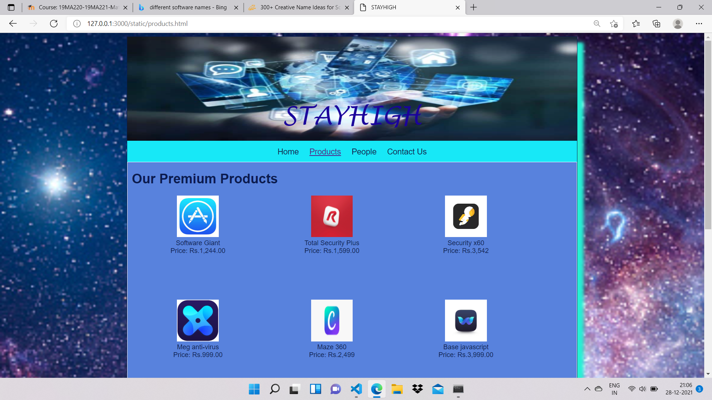

# Web Design for a Software Product Company

## AIM:

To design a static website for a software product company company.

## DESIGN STEPS:

### Step 1:

Requirement collection.

### Step 2:

Creating the layout using HTML and CSS.

### Step 3:

Updating the sample content.

### Step 4:

Choose the appropriate style and color scheme.

### Step 5:

Validate the layout in various browsers.

### Step 6:

Validate the HTML code.

### Step 6:

Publish the website in the given URL.

## PROGRAM :
HOME PAGE:
<!DOCTYPE html>
<html lang="en">
  <head>
    <title>MUSIC BANG</title>
    <link rel="stylesheet" href="./css/layout.css" />
    <link rel="icon" href="./img/icon.png" type="image/x-icon" />
  </head>

  <body>
    

      
MUSIC BANG

      

        
<a href="/static/home.html">Home</a>

        
<a href="/static/products.html">Products</a>

        
<a href="/static/people.html">People</a>

        
<a href="/static/contact us.html">Contact Us</a>

      

      

        

          <h1>WELCOME TO MUSIC BAND!!!</h1>
          

          <h1>About Us</h1>
          
          

           AT MUSIC BANG WE ARE PROVIDING TOP COLLECTIONS OF THE ALBUMS,PRODUCTS 
           RELATED TO THE ALBUMS,MERCHES OF THE ALBUMS,DISCOUNT DURING AT THE 
           TIME OF FESTIVALS AND MANY MORE TO EXPLORE WITH GREATE JOY.ALL THE 
           PRODUCTS ARE AVAILABLE AT ECONOMIC RATE WHICH IS AFFORDABLE FOR 
           ALL THE PEOPLE.HOPE YOU ENJOY PRODUCTS AND WE WILL BE VERY HAPPY 
           TO RECEIVE YOUR WONDERFUL COMMENTS. 
        
             
            ALL OUR PRODUCTS ARE PROPERLY AUTHORISED BY THE GOVT.HOPE YOU 
            ENJOY OUR PRODUCT WITHOUT ANY ISSUES.IF YOU ARE NOT SATISFIED
            OR WANT TO RETURN OUR PRODUCT YOU ARE ALWAYS WECOMED TO OUR 
            CUSTOMER SERVICE AND YOU CAN RISE THE ISSUE FACED,SO THAT OUR
            MANAGERS CAN HANDLE IT AT MOST OF YOUR WILL.  
            Many varities 
            Easy to return 
            Many suprising offers 
            THANKYOU AND ENJOY YOUR MUSIC!!! 
          

        

      

      

        Copyright &#169; 2021 Music BANG, Developed by G.Pavithra.
      

    

  </body>
</html>
PRODUCT:
<!DOCTYPE html>
<html lang="en">
  <head>
    <title>MUSIC BANG</title>
    <link rel="stylesheet" href="./css/layout.css" />
    <link rel="icon" href="./img/icon.png" type="image/x-icon" />
  </head>

  <body>
    

      
MUSIC BANG

      

        
<a href="/static/home.html">Home</a>

        

          <a href="/static/products.html">Products</a>
        

        
<a href="/static/people.html">People</a>

        
<a href="/static/contact us.html">Contact Us</a>

      

      

        
    
          <h1>Available Products</h1>
          

              
 
                  

                  
                  

                  
Yamaha f280

                  
Price: Rs.6990.00 

              

              
 
                  

                  
                  

                  
Surjan Singh & Sons brass tabla

                  
Price: Rs.12,000.00 

              

              
 
                

                
                

                
Wooden Saraswati Veena, 1-3 Kg
                

                
Price: Rs.13,299.00 

            

            
 
              

              
              

              
Yamaha YTR-2330S
              

              
Price: Rs.3999.00 

            

            
 
              

              
              

              
Altus
              

              
Price: Rs.3599.00 

            

            
 
              

              
              

              
 Fiber Congo Drum

              
Price: Rs.2999.00 

            

            
 
              

              
              

              
 albums

              
Price: Rs.500.00-2000.00 

            

            
 
              

              
              

              
 albums

              
Price: Rs.500.00-2000.00 

            

            
 
              

              
              

              
 albums

              
Price: Rs.500.00-2000.00 

            

            
 
              

              
              

              
 tshirt

              
Price: Rs.150.00 

            

            
 
              

              
              

              
 tshirt

              
Price: Rs.200.00 

            

            
 
              

              
              

              
 tshirt

              
Price: Rs.150.00 

            

            
            
 
              

              
              

              
 set(tshirt with tracks)

              
Price: Rs.350.00 

            

          

        
        
      

      

        Copyright &#169; 2021 Music BANG, Developed by G.Pavithra.
      

    

  </body>
</html>
PEOPLE:
<!DOCTYPE html>
<html lang="en">
  <head>
    <title>MUSIC BANG</title>
    <link rel="stylesheet" href="./css/layout.css" />
    <link rel="icon" href="./img/icon.png" type="image/x-icon" />
  </head>

  <body>
    

      
MUSIC BANG

      

        
<a href="/static/home.html">Home</a>

        

          <a href="/static/products.html">Products</a>
        

        
<a href="/static/people.html">People</a>

        
<a href="/static/contact us.html">Contact Us</a>

      

      

        
    
          <h1>OUR WORKERS</h1>
          

              
 
                  

                  
                  

                  
Mrs.Cressida

                  
Manager 

              

              
 
                  

                  
                  

                  
Mrs.Delisha

                  
Asst.Manager 

              

              
 
                

                
                

                
Mrs.Frideswide
                

                
Product promoter 

            

            
 
              

              
              

              
Mr.David Parker
              

              
Sales head 

            

            
 
                

                
                

                
Mr.Lucas Williams
                

                
Backend support head

              

        

    
        
  

  

    Copyright &#169; 2021 Music BANG, Developed by G.Pavithra.
  

</body>
</html>
CONTACT US:
<!DOCTYPE html>
<html lang="en">
  <head>
    <title>MUSIC BANG</title>
    <link rel="stylesheet" href="./css/layout.css" />
    <link rel="icon" href="./img/icon.png" type="image/x-icon" />
  </head>

  <body>
    

      
MUSIC BANG

      

        
<a href="/static/home.html">Home</a>

        
<a href="/static/products.html">Products</a>

        
<a href="/static/people.html">People</a>

        
<a href="/static/contact us.html">Contact Us</a>

      

      

        

          <h1>Thankyou for choosing our website</h1>
          

          <h1>Contact us:</h1>
          

           ADDRESS:MUSIC BANG PLAZZA,1134 S Montreal Ave,
           Dallas, TX 75208 
        
             
            CONTACT EMAIL:musicbang_contactus@gmai.com  
            Enjoy our product. 
            Keep smiling. 
            Support and share our products. 
            THANKYOU AND ENJOY YOUR MUSIC!!! 
          

        

      

      

        Copyright &#169; 2021 Music BANG, Developed by G.Pavithra.
      

    

  </body>
</html>

## OUTPUT:

### Home Page:

### Product:

### People:

### contact:

## Result:

Thus a Website is designed for the software product company and the HTML,CSS code are validated.
